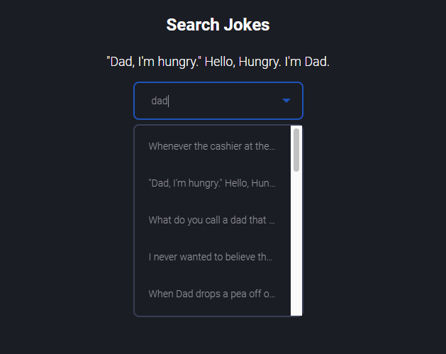

# Jokes Searcher

- Demo on Netlify: [LINK](https://jokes-searcher.netlify.app)
- API URL: [Github REST API(v3)](https://icanhazdadjoke.com/api)
- Repo url: [LINK](https://github.com/PiotrRynio/jokes-searcher)

## Overview:

A simple React app for searching dad jokes from icanhazdadjoke Api.

### Start:

1. npm install
2. npm run start

Others:

1. Compile and minify for production `npm build`
2. Run all tests `npm test`

## Project rules:

- [css order](https://css-tricks.com/poll-results-how-do-you-order-your-css-properties/)
- [commit notation](https://gist.github.com/brianclements/841ea7bffdb01346392c#type)

## Screens:

## Authors:

_Piotr Rynio_  
Contact:
pwrynio@gmail.com
 [github.com/PiotrRynio](https://github.com/PiotrRynio)
